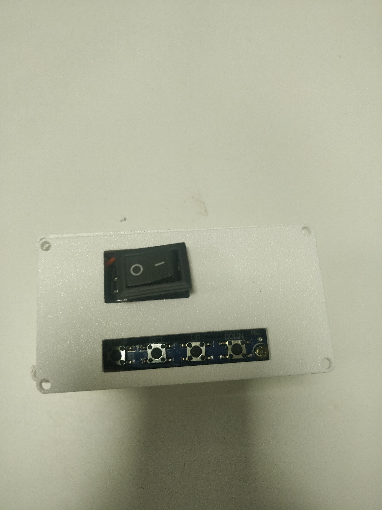
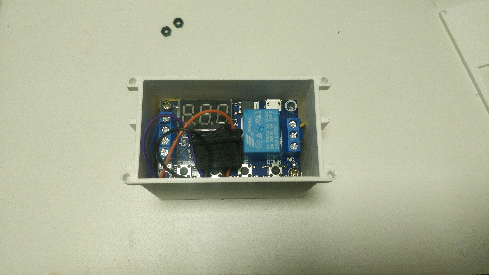

# ⏱️ Wearable Vibration Timer Module

A compact **wearable vibration timer module** designed to provide periodic haptic feedback using a vibration motor. The device is enclosed in a **3D-printed wearable casing** that can be comfortably strapped around the hand.

The timer is configured to activate the vibration motor **every 20 minutes**, serving as a reminder system for applications such as posture correction, physiotherapy, medication reminders, repetitive task alerts, or wearable assistive devices.

---

## Project Overview

<div align="center">
  
</div>

---

## Features

- ⏲️ Timer-based vibration reminder
- 📳 Vibration every **20 minutes**
- 🖐️ Wearable 3D-printed enclosure
- 🔋 Powered using a 9V battery
- ⚡ Relay-controlled vibration motor
- 🛠️ Compact and portable design
- 🔄 Automatic periodic operation

---

## Components Used

| Component | Quantity |
|-----------|----------|
| Timer Module | 1 |
| Relay Module | 1 |
| Vibration Motor | 1 |
| 9V Battery | 1 |
| Battery Connector | 1 |
| 3D Printed Wearable Enclosure | 1 |
| Connecting Wires | As required |

---

## Working Principle

1. The timer module is configured with a **20-minute interval**.
2. After every 20 minutes, the timer energizes the relay.
3. The relay switches power to the vibration motor.
4. The vibration motor provides haptic feedback for the preset duration.
5. After the vibration cycle, the timer restarts automatically for the next interval.

---

## System Workflow

```text
9V Battery
      │
      ▼
 Timer Module
      │
      ▼
 Relay Module
      │
      ▼
 Vibration Motor
      │
      ▼
 Periodic Vibration Every 20 Minutes
```

---

# Connection Diagram

```text
               +----------------------+
               |      9V Battery      |
               +----------+-----------+
                          |
                          |
                +---------v----------+
                |    Timer Module    |
                +---------+----------+
                          |
                Trigger Output
                          |
                          |
                +---------v----------+
                |    Relay Module    |
                +---------+----------+
                          |
          +---------------+--------------+
          |                              |
          |                              |
      COM |                          NO  |
          |                              |
          |                              |
          +------------------------------+
                          |
                          |
                    Vibration Motor
                          |
                          |
                        Battery (-)
```

---

## Wearable Design

- Custom-designed 3D printed enclosure
- Lightweight construction
- Comfortable hand-mounted design
- Easy access to battery replacement
- Compact electronics integration

<div align="center">
  
</div>

---

## Applications

- Physiotherapy reminders
- Posture correction
- Medication reminders
- Industrial worker alert system
- Rehabilitation devices
- Habit reminder system
- Productivity timer
- Wearable assistive technology

---

## Future Improvements

- Rechargeable Li-ion battery
- USB Type-C charging
- Bluetooth connectivity
- Mobile application integration
- Adjustable vibration intensity
- OLED display
- Multiple reminder intervals
- Buzzer and LED indication
- Waterproof enclosure

---


## License

This project is intended for educational, research, and wearable electronics applications.
